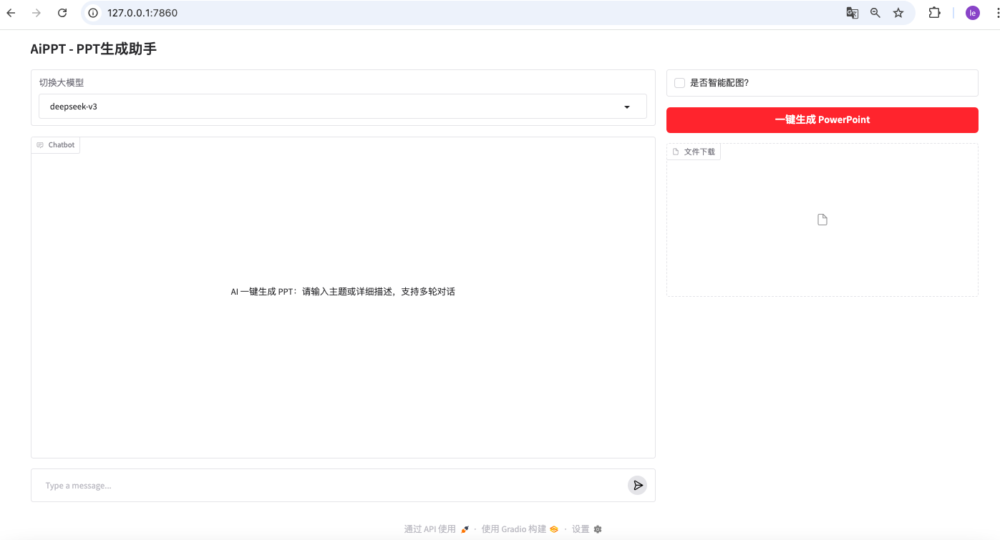
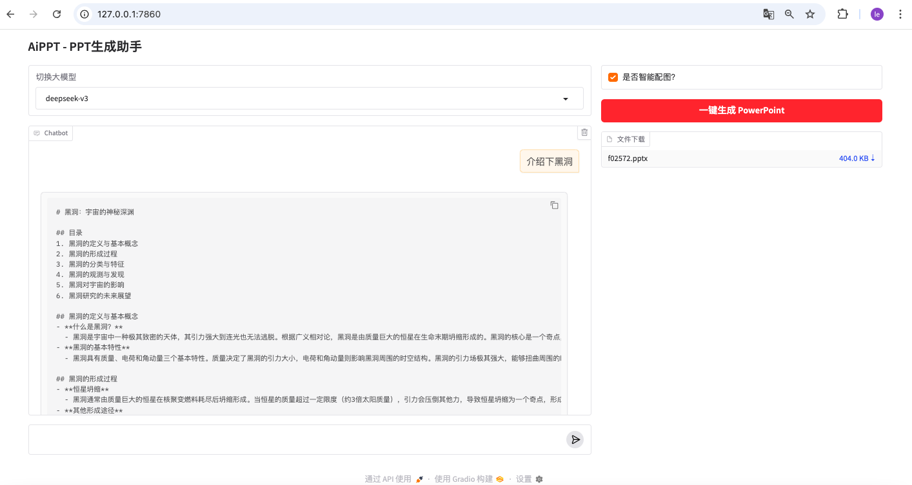

# AI 自动生成 PPT 项目

一个基于 AI 的自动化演示文稿生成工具，支持多轮对话交互、智能配图以及模型切换。通过简洁易用的 Gradio Web 界面，用户只需输入主题或描述，即可一键生成精美的 PowerPoint 演示文稿。

------

## ✨ 项目功能

- **一键生成 PPT**
   仅需输入主题或详细描述，系统即可自动生成完整的 PPT 内容结构与页面。
- **支持多轮对话**
   可以与用户进行多轮对话，优化和补充演示内容，生成更贴合需求的幻灯片。
- **智能配图**
   自动为幻灯片添加相关图片，提升演示美观性和表达力。
- **模型灵活切换**
   支持接入多个 LLM（大语言模型），便于根据使用场景灵活切换模型。
- **Gradio Web 界面**
   提供用户友好的网页界面，无需命令行操作，即可快速体验。

------

## 🧰 技术栈

| 技术/工具     | 说明                             |
| ------------- | -------------------------------- |
| Python 3.10   | 项目基础语言                     |
| Langchain 0.3 | LLM 调用与链式处理               |
| LangGraph     | 实现多轮对话、联网搜索流程图逻辑 |
| Gradio        | 构建交互式 Web 前端              |
| python-pptx   | 自动创建和编辑 PowerPoint 文件   |

------

## 🚀 快速开始

#### 搭建开发环境

本项目基于python 3.10开发，并使用langchain0.3、LangGraph、gradio 相关技术

完整 python 依赖包见 `requirements.txt` 文件

##### 配置 API key

目前项目中支持 deepseek-v3、gpt-4o 两个模型切换，并利用 tavily 工具实现了联网搜索。需要进行相应`API_KEY`配置

根据你使用的命令行工具，在 `~/.bashrc` 或 `~/.zshrc` 中配置 `API_KEY` 环境变量：

```
export OPENAI_API_KEY="xxxx"
export DEEPSEEK_API_KEY="xxx"
export TAVILY_API_KEY="xxx"
```

##### 克隆代码

```
git clone https://github.com/caile188/ai-ppt.git
cd ai-ppt
```

##### 安装依赖

```
pip install -r requirements.txt
```

##### 运行项目

```
python app.py
```

##### 效果展示





------

## 📄 许可协议

本项目采用 Apache2.0 License。